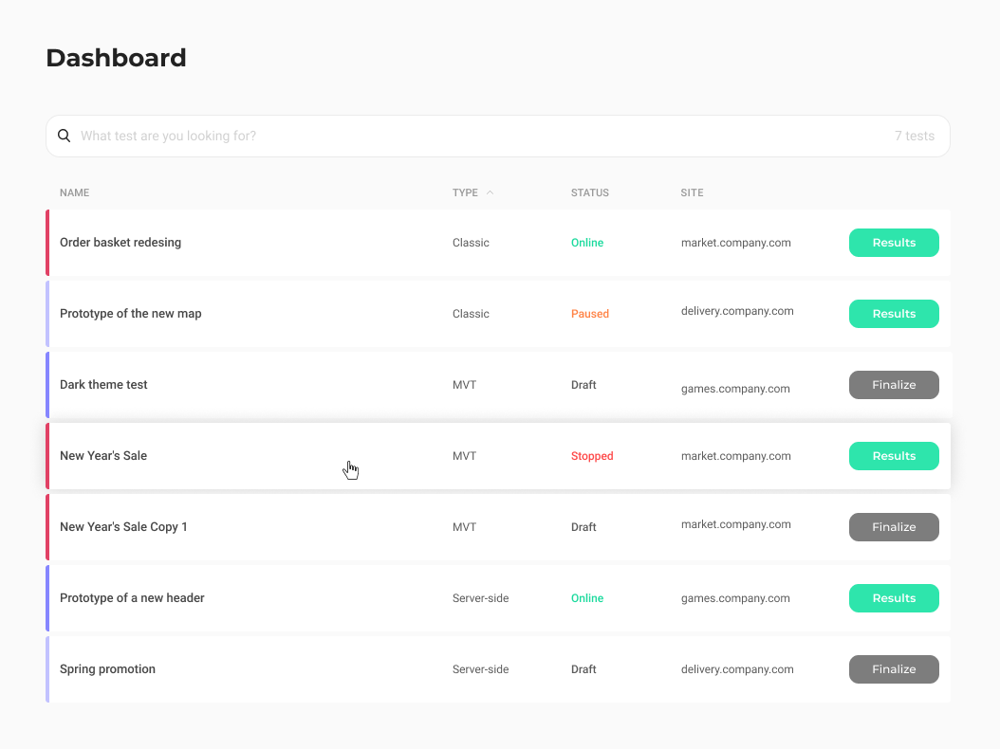

# Task for frontend developers

This is a test task to write an app in React.js, HTML and CSS.

### Functionality requirements

The app is a dashboard page which used to display a list of created A/B tests ([Figma](https://www.figma.com/file/PFdFpIajQbuGibIbEYnE3l/Interview-task-for-frontend-developers)).

- The table is filled with the data that is requested from the JSON file using the API in [this repository](https://development.kameleoon.net/oivanov/frontend-interview-task-api).
- When a user hovers over a table row it should be highlighted as shown in the mockup.
- Sites in the corresponding column must be displayed without the **`http`** or **`https`** protocols and **`www`** prefix.
- A user should be able to filter by item name. If the item exists we hide other
  records and show only items that were found in the list. If no records are found there should
  be a message with the corresponding text and a reset button (see [Figma](https://www.figma.com/file/PFdFpIajQbuGibIbEYnE3l/Interview-task-for-frontend-developers)).
- A user should be able to sort (**`ASC`**, **`DESC`**) by clicking on the titles of the columns:
  - **`name`**, **`type`** and **`site`** should be sorted in alphabetical order
  - **`status`** should be sorted in:
    - **`ASC`**: Online, Paused, Stopped, Draft
    - **`DESC`**: Draft, Stopped, Paused, Online

### Additional tasks

- Using the `react-router-dom` library, implement routing between three pages: **`dashboard`**, **`results`**, and **`finalize`**.
- When a user clicks on the **`Results`** or **`Finalize`** button on dashboard page, you should redirect to URLs **`/results/[testId]`** and **`/finalize/[testId]`** accordingly, without reloading the browser window.
- App is written using TypeScript.
- Unit tests with Jest are done.

### To start app

Backend:

- Clone a repository: git clone git@development.kameleoon.net:oivanov/frontend-interview-task-api.git

- Install dependencies: npm install

- Run server: npm start

Frontend:

- Clone a repository: git clone https://github.com/myr-irina/kameleoon-frontend-task.git

- Install dependencies: npm install

- Run app: npm run start
